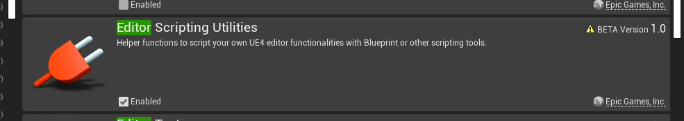

# Merge Volume
# UE4.21 Tool to merge larger meshes and instance smaller ones.

While UE4.22 has now an excellent auto-instancing rendering pipeline, some projects still unfortunately have to stay on 4.21 for now, and that comes with its own share of problems; one namely being that with no automatic instancing each static mesh actor is one draw call - with large modular scenes this becomes very problematic.

With this very simple tool, drag a bounding volume over mid-sized chunks of your level and press merge; largers meshes will be merged into one static mesh (good for modular kits, merge rooms or buildings) and smaller meshes will be instanced (greeble and furniture). You can adjust the size threshold but 170-200 is a pretty good value.

Keep in mind you will need to have the *Editor Scripting Utilities* plugin enabled in your project for this plugin to work. 
 
